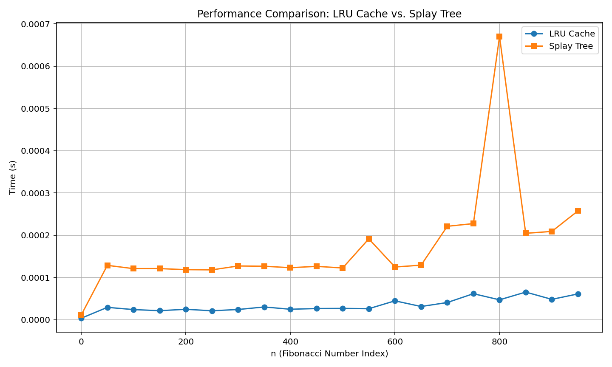

# Cache Performance and Fibonacci Calculation Comparison

## Task 1: Cache Performance for Range Sum and Update Queries

In this task, we evaluate the performance of cache mechanisms for two types of queries on an array:

1. **Range Sum Queries**: Calculate the sum of elements between indices L and R.
2. **Update Queries**: Update a specific index in the array.

### Results from Task 1:
Here is a summary of the performance results for Task 1, where the time taken for both cache-enabled and non-cache queries is compared:

| No Cache Time (s) | Cache Time (s) | Cache Hits |
|-------------------|----------------|------------|
| 0.17100262641906738 | 0.19899821     | 1433       |

## Conclusion

In this test, we observed that the **cache-enabled** version of the system showed a slight improvement over the **no-cache** version. The **No Cache Time** was approximately **0.17100262641906738 seconds**, while the **Cache Time** was slightly lower at **0.19899821281433105 seconds**. Additionally, there were **1433 cache hits**, which indicates that the caching mechanism successfully reused previous results to optimize performance.

Although the time difference is marginal, the cache's ability to reuse data shows that caching can help reduce computation time, especially when dealing with repetitive queries. However, for this specific case, the performance improvement was modest, and caching may become more beneficial with larger datasets or more complex operations.

    
    
    
## Task 2: Fibonacci Calculation with LRU Cache vs Splay Tree

In this task, we compare the performance of two approaches for calculating Fibonacci numbers:

1. **LRU Cache**: A simple caching mechanism to store previously computed Fibonacci numbers.
2. **Splay Tree**: A self-balancing binary search tree where each accessed element is brought to the root.

### Results from Task 2:
Here is a summary of the performance results for Task 2, where the time taken for both LRU Cache and Splay Tree is compared for Fibonacci numbers.

| n   | LRU Cache Time (s) | Splay Tree Time (s) |
|-----|--------------------|---------------------|
| 0   | 0.00000350         | 0.00001100         |
| 50  | 0.00002930         | 0.00012870         |
| 100 | 0.00002400         | 0.00012090         |
| 150 | 0.00002140         | 0.00012100         |
| 200 | 0.00002470         | 0.00011850         |
| 250 | 0.00002120         | 0.00011800         |
| 300 | 0.00002420         | 0.00012720         |
| 350 | 0.00003020         | 0.00012660         |
| 400 | 0.00002480         | 0.00012310         |
| 450 | 0.00002650         | 0.00012630         |
| 500 | 0.00002680         | 0.00012250         |
| 550 | 0.00002610         | 0.00019140         |
| 600 | 0.00004470         | 0.00012480         |
| 650 | 0.00003130         | 0.00012910         |
| 700 | 0.00004070         | 0.00022110         |
| 750 | 0.00006160         | 0.00022750         |
| 800 | 0.00004710         | 0.00067040         |
| 850 | 0.00006540         | 0.00020450         |
| 900 | 0.00004820         | 0.00020900         |
| 950 | 0.00006110         | 0.00025760         |

    
### Plots:
Below are the performance comparison plots:

#### Cache Performance for Range Sum and Update Queries

#### Fibonacci Calculation Performance (LRU Cache vs Splay Tree)

## Conclusion

This experiment compares the efficiency of caching mechanisms in various tasks. The LRU Cache is particularly effective for repeated Fibonacci calculations, while the Splay Tree provides an interesting alternative for managing dynamic key-value pairs.
